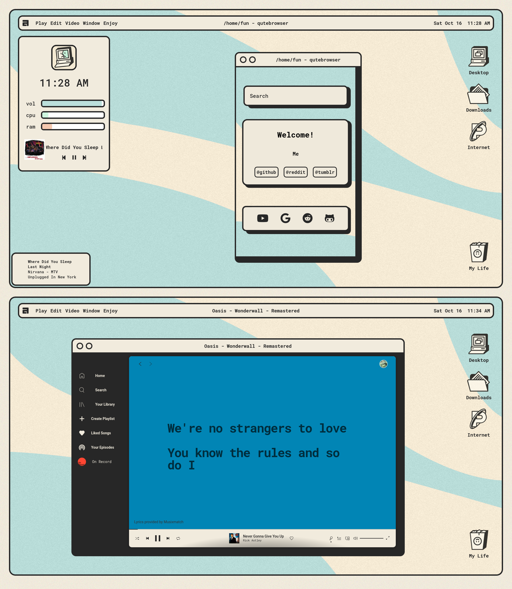

# ✨**FORK Awesomewm Dotfile**✨
# [Original source](https://github.com/ChocolateBread799/dotfiles/tree/099a9a63fa4d3a105ed1e3254d31ca3264c413d7)
I didn't want to fork it directly because it was unrelated to main.
if i am wrong pls contact me.

thanks for [javacafe01](https://github.com/JavaCafe01)
thanks for [ChocolateBread799](https://github.com/ChocolateBread799)

# **Required**
- [Rofi](https://github.com/davatorium/rofi)
- [wezterm](https://wezfurlong.org/wezterm/)
- [Ibhagwan Forked Picom](https://github.com/ibhagwan/picom)
- [Roboto Mono](https://fonts.google.com/specimen/Roboto+Mono)

# **Module**

- [Bling](https://blingcorp.github.io/bling/) !!!!You should clone in ~/.config/awesome!!

## **Screenshot**

